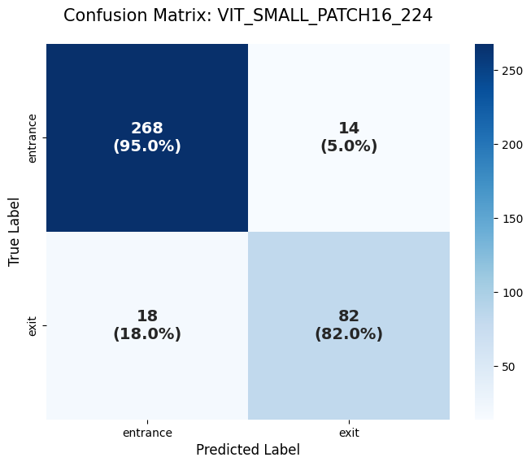
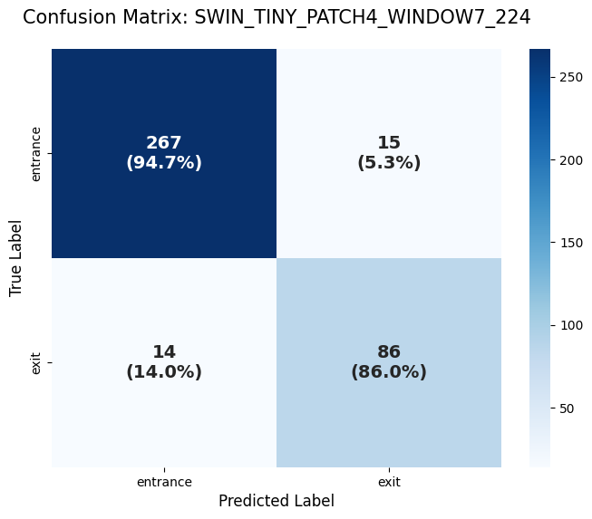
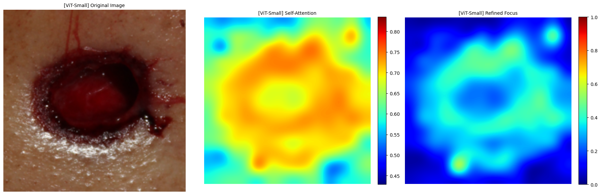
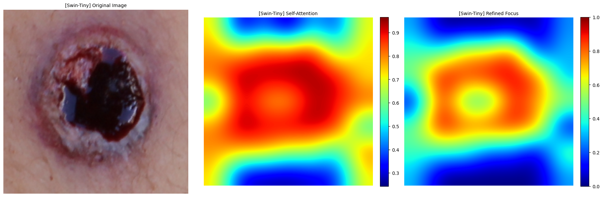

# 🩸 Forensic Gunshot Wound Classification: A Vision Transformer (ViT) Benchmark

## 🩺 1. Problem Definition & Objectives
While CNNs have shown great success in forensic imaging, **Vision Transformers (ViT)** offer a unique advantage by capturing global spatial dependencies and patch-based morphological markers. This project benchmarks state-of-the-art Transformer architectures—**ViT-Small** and **Swin-Transformer**—to evaluate their efficacy in distinguishing **Entrance** vs. **Exit** gunshot wounds.

By utilizing **Self-Attention Mechanisms**, this study investigates whether Transformer-based models can more accurately identify subtle forensic indicators, such as the continuity of abrasion rings and the complexity of radial lacerations, compared to traditional convolutional approaches.

## 📊 2. Dataset Specifications
The models were trained and evaluated using the **FDCPUnBGunshotDB**, following the same rigorous preprocessing pipeline as the previous CNN benchmark.

* **Dataset Source:** [FDCPUnBGunshotDB GitHub](https://github.com/pedrogarciafreitas/FDCPUnBGunshotDB)
* **Classes & Distribution:**
  - **Entrance Wounds:** 1,883 images (Class 0)
  - **Exit Wounds:** 671 images (Class 1)
* **Transformer-Optimized Preprocessing:**
  - **Center-Focus Strategy:** Implemented a **CenterCrop (224x224)** approach to focus strictly on the wound's central morphology and align with patch-based tokenization.
  - **Imbalance Handling:** Utilized **Weighted Cross-Entropy Loss** (Ratio 1:2.8) to ensure high sensitivity for the minority class (Exit wounds).

## 🚀 3. Key Technical Features
* **Transformer Benchmarking:** Comprehensive evaluation of **ViT-Small (patch16)** and **Swin-Tiny (window7)** using the `timm` (PyTorch Image Models) library.
* **Hierarchical Feature Extraction:** Implementation of Swin Transformer to capture multi-scale forensic textures through shifted window mechanisms.
* **Explainable AI (XAI) for Transformers:** Developed a specialized visualization pipeline using **Self-Attention Mapping** and **Contrast-Enhanced Refined Attention**, bypassing the gradient-instability issues of traditional Grad-CAM.
* **Hardware:** Optimized for training on **Google Colab L4 GPU** environments, achieving SOTA results within minimal training time.

## 📈 4. Performance Metrics (Benchmark Results)
The Transformer models demonstrated superior performance over traditional CNN baselines, with **Swin-Tiny** achieving the highest overall accuracy of **93.3%**.

| Model | Accuracy | Entrance Recall | Exit Recall | Note |
| :--- | :---: | :---: | :---: | :--- |
| **Swin-Tiny** | **93.3%** | **97.9%** | **79.9%** | **Best Overall Accuracy & Sensitivity** |
| **ViT-Small** | **91.1%** | **96.0%** | **77.6%** | **Strong Global Dependency Mapping** |
| ResNet50 (Baseline)| 87.0% | 91.0% | 75.0% | Previous CNN Benchmark |

---

## 🔍 Visual Analysis Comparison (XAI)

### A. Confusion Matrix (CM) Results
The Transformers show significantly improved recall for Entrance wounds, reaching up to **97.9%** with Swin-Tiny—effectively minimizing false negatives in forensic documentation.

#### 1. ViT-Small Confusion Matrix

#### 2. Swin-Tiny Confusion Matrix

---

### B. Model Interpretability (Self-Attention & Refined Focus)
Instead of traditional Grad-CAM, we utilized **Self-Attention Mapping** to visualize the diagnostic logic.

1. **Self-Attention (Global Context):** Illustrates how the model captures perilesional skin textures and tissue tension across the entire image.
2. **Refined Attention (Marker Focus):** Highlights the most discriminative morphological features. Analysis reveals that the models prioritize **forensic margins** (abrasion collars and radial tears) while correctly identifying the non-informative central cavity as a "void" zone.

#### 1. ViT-Small Attention Analysis

#### 2. Swin-Tiny Attention Analysis

---

## 📝 Research Collaboration
This project is part of an ongoing research collaboration with **Dr. Lorenzo Gitto**, a Forensic Pathologist at the Cook County Medical Examiner's Office. This benchmarking provides empirical evidence for the use of Transformer-based architectures as objective decision-support tools in forensic science.

---

## 🧑‍⚕️ About the Author
**Hee Jae Ryu (HEE JAE RYU), MD**
* **Pathology Residency Applicant (2026 Match)**
* **MD, Chungbuk National University College of Medicine**
* **Content Creator at 'CowEye' (1.68M+ Subscribers)**
* **Primary Interests:** Digital Pathology, Forensic Science, and AI-driven Diagnostics
